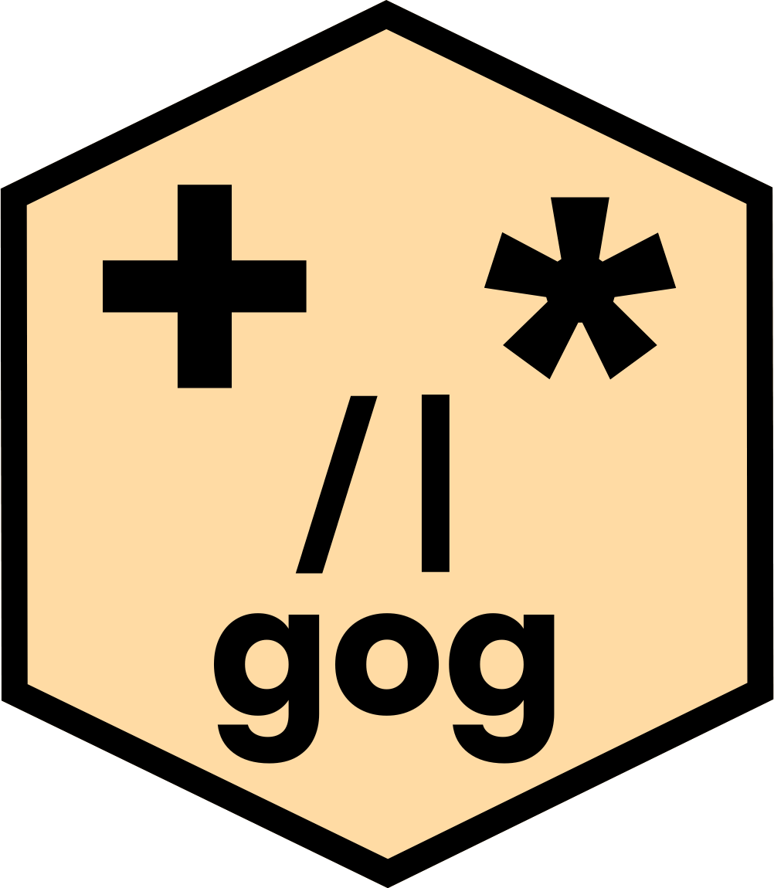
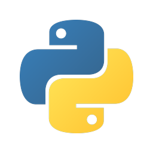

# gog — a grammar of graphics



One graphics engine, written in Rust, spoken from four languages. Plots are
**specifications, not drawing code**: you say what you want to see, and the engine
decides every stroke.

```r
data(gapminder_2007) + point + x(gdp) + y(life) + color(continent)
```

Read it aloud: *"Given gapminder 2007 — points, x is gdp, y is life, color by
continent."* That sentence is the entire program. You named a table, a mark, two
positions and a channel. The engine chose the axes, the ticks, the margins and
the palette, and it drew the legend because a mapped column earns one. That is a
rule, not a convenience.

**📖 The manual is online, and every plot in it was drawn by this engine:
<https://psychometrician.github.io/gog-book/>**

## Why another one

Most plotting tools ask you to memorize chart types. Each type is its own
picture with its own arguments in its own order, so learning one teaches you
little about the next. The best tools are real grammars instead, where small
parts combine. But their rules for combining collect exceptions over the years,
until using them well becomes a specialist's skill.

gog takes its discipline from **Hangeul**, the Korean alphabet designed in 1443.
A learner can pick it up in a morning. The reason is not that it has few
letters, because English has few letters too and still takes years to write
well. The reason is that **its letters combine without exceptions**. The power
was never in the parts. It was in the regularity with which they join.

So a histogram is nothing to memorize. It is `bar * bin`, derived rather than
invented, the way ㅋ is derived from ㄱ. Keep the statistic and change the mark,
and the same counts draw a line, an area or a step. One law stands over the
whole library: **a rule you learn on one mark holds on every mark, or the
library has failed you.**

Every plot has the same shape:

```
data(table) + mark + positions + refinements
```

The design answers to [nine laws](CONTRIBUTING.md#the-nine-laws) — orthogonality,
no exceptions, plain names, bind-once, and five more — with one enemy behind all
of them: *the expert's shortcut*.

## The same plot, in four languages

<p align="center">
  
  &nbsp;&nbsp;&nbsp;
  
  &nbsp;&nbsp;&nbsp;
  <picture>
    <source media="(prefers-color-scheme: dark)" srcset="images/julia-dark.png">
    
  </picture>
  &nbsp;&nbsp;&nbsp;
  
</p>

One grammar, four spellings. The first three are one sentence written three
times, and they differ only in how a column is named. JavaScript cannot overload
`+ * | /`, so it spells those four operators as four words. (Each logo above
names the language it stands for and belongs to its owner; the attribution is in
[`images/NOTICE`](images/NOTICE).)

```r
# R
data(gm) + point + x(gdp) + y(life) + color(continent)
```
```python
# Python
data(gm) + point + x(col.gdp) + y(col.life) + color(col.continent)
```
```julia
# Julia
data(gm) + point + x(:gdp) + y(:life) + color(:continent)
```
```js
// JavaScript
plot(data(gm), point, x(col.gdp), y(col.life), color(col.continent))
```

All four produce **byte-identical SVG**, and that is enforced rather than hoped:
three parity harnesses draw every sentence in the manual and compare against R.

## Install

```r
# R
install.packages("gog", repos = c("https://psychometrician.r-universe.dev",
                                  "https://cloud.r-project.org"))
```
```bash
# Python
pip install gog
```
```julia
# Julia
using Pkg; Pkg.add("GrammarOfGraphics")
```
```bash
# JavaScript
npm install grammar-of-graphics
```

All four are live, on
[r-universe](https://psychometrician.r-universe.dev/gog),
[PyPI](https://pypi.org/project/gog/),
[General](https://github.com/JuliaRegistries/General/tree/master/G/GrammarOfGraphics)
and [npm](https://www.npmjs.com/package/grammar-of-graphics). Three of them
**ship the engine inside the package**, built for your platform. For those three
there is nothing else to install, nothing to put on your `PATH`, and no Rust
toolchain to set up.

Each of those three also carries a second copy of the engine, built for the
browser. That is what lets a 3-D plot turn under the mouse on a web page. It is
optional: a package without it still draws every plot, and the 3-D ones simply
do not turn.

`gog` is not on CRAN yet. That is why the R line names r-universe first and a
CRAN mirror second, and the second entry is what keeps your other packages
resolving.

Julia is the one binding that does not bundle the engine yet, so `Pkg.add` gives
you a package that loads but cannot draw until a `gog-cli` exists on your
machine. Build it once with `cargo build --release -p gog-cli`, or set
`ENV["GOG_CLI_PATH"]` to a copy you already have. The package says both of those
in the error it raises, so nobody has to guess.

## The vocabulary

The whole kernel, and it fits on one screen. The combinations *are* the chart
types — there is no `histogram()` to look up.

| | |
|---|---|
| **Tables** | `data` `query` |
| **Marks** | `point` `line` `area` `bar` `step` `interval` `box` `ribbon` `text` `path` `rule` `zone` `surface` |
| **Channels** | `x` `y` `z` `color` `size` `shape` `pattern` `opacity` `group` `label` `play` |
| **Selections** | `click`⬜ `brush` |
| **Transforms** | `bin` `smooth` `count` `density` `proportion` `sum` `mean` `median` `max` `min` `range` `confidence` `bounds` `partition`, plus `dodge` `stack` `jitter` |
| **Scales** | `linear` `log` `time` `category` `order` |
| **Spaces** | `flat` `space` `polar` `nest` `map` |
| **Labels** | `title` `x_label` `y_label` `z_label` |
| **Settings** | `style` `theme` `palette` |
| **Composition** | `facet`, and the operators: layering `+`, derivation `*`, arranging `\|` and `/` |

One word carries ⬜ because it is **not drawn yet**: `click`. It is not callable
either, so your language reports a missing function rather than GOG explaining
itself. Everything else above draws today: every mark, every channel, every
transform and every space.

What GOG never does is accept one of these names and quietly ignore it. Nothing
is accepted and silently dropped, so a plot that draws is a plot that means what
you wrote.

## Architecture

<p align="center">
  <picture>
    <source media="(prefers-color-scheme: dark)" srcset="images/rust-dark.png">
    
  </picture>
</p>

One engine, and all four languages narrow down to it. The four spellings above
are what a person writes. Rust is what runs, below all of them, and it holds no
opinion the grammar did not give it.

```
r-pkg/gog                 ─┐
py-pkg/gog                 │
jl-pkg/GrammarOfGraphics   ├─build spec─▶ JSON ─stdin─▶ gog-cli ─▶ gog-core ─▶ SVG
js-pkg/gog                ─┘                            (bridge)   (the engine)
```

Each front end is a thin layer that builds a specification, and the engine does
everything else. A rule written into one binding is a rule the other three will
get wrong, so anything more than one binding needs lives in `gog-core`.

The specification describes the *visual*, never one renderer's draw commands, so
a second renderer would change nothing above it. The workspace depends on
nothing but `serde` and `serde_json`.

## Build from source

Requires a Rust toolchain, and the language you want to drive it from.

```bash
cargo build --release
cargo test --release
cargo run --release --example scatter    # also: bar, transforms
```

The engine is language-agnostic. It reads a JSON specification on stdin and
writes SVG to stdout, so anything that can spawn a process can drive it:

```bash
echo '{ … }' | ./target/release/gog-cli > plot.svg
```

For R, install the package from this checkout. `configure` bundles the engine
into it, building the crate from source if no binary is present:

```bash
R CMD INSTALL --no-docs r-pkg/gog
```

## The book

`book/` is the manual, written in Quarto, and **every plot in it is live** —
drawn by the engine as the page builds. Nothing is a screenshot; if a page shows
it, the engine drew it. A 3-D plot turns under your mouse, because the same
engine is compiled for the browser and shipped with the page. Refusals are live
too. The engine's *no* always comes with a direction, and that is half of what
the manual teaches.

```bash
cd book && quarto preview
```

It opens with the whole grammar in one sitting. Then it takes each family of
atoms in depth, then composition, then a cookbook. The cookbook is organized by
your data's shape and your question, never by chart name.

## Contributing

[`CONTRIBUTING.md`](CONTRIBUTING.md) has the nine laws the grammar obeys, the
module map, the file-organization rules, and what to run before opening a pull
request.

## License

Code is **Apache License 2.0** — see [LICENSE](LICENSE), and [NOTICE](NOTICE) for
the color schemes this project carries from elsewhere. Each binding keeps its own
copy of both. A wheel, an npm tarball and a Julia package are each built from a
directory below this one, so a copy has to sit there.

The book's prose is **CC BY-NC-SA 4.0** — see [book/LICENSE.md](book/LICENSE.md).
