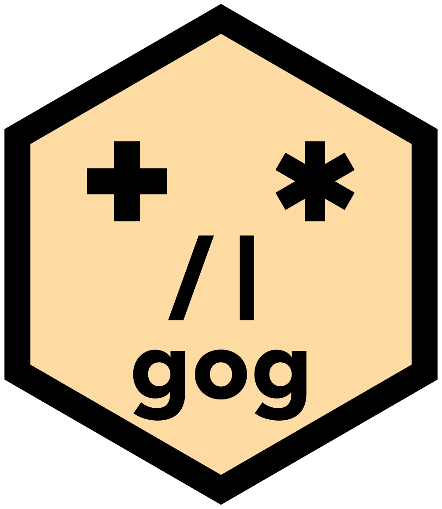

::: {.site-hero}
{.site-hero-img fig-alt="The gog hex sticker: a peach hexagon holding a face built from the four operators."}

::: {.site-hero-text}
# We build tools for looking at data.

**gog** is a grammar of graphics: one engine written in Rust, spoken from R,
Python, Julia and JavaScript. Describe a plot in any of the four and you get the
same picture, not a similar one.

The posts below are short pieces, each introducing one part of gog. To see
everything it can do, we recommend
[the book](https://psychometrician.github.io/gog-book/): 654 plots, and not one
of them is a screenshot.

[Be agog. Use gog.]{.site-slogan}
:::
:::
